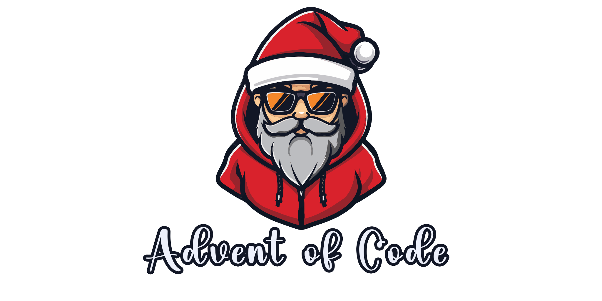
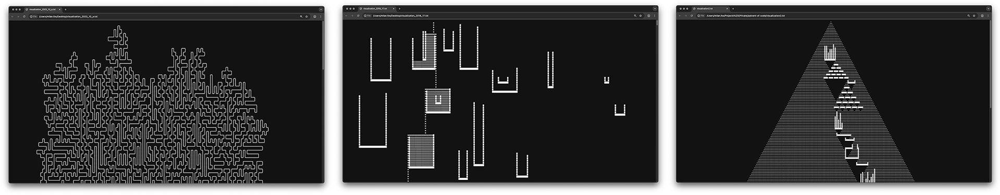

Welcome to my "Advent of Code" repository! This repository contains my solutions to the Advent of
Code challenges, implemented exclusively in **JavaScript**.

This repository is for educational purposes and to share my approach to solving the Advent of Code
challenges. Feel free to explore, modify, and use any code you find here for your own learning and
projects.

### Setup

To run the solutions, follow these steps:

1. Provide your own `input.txt` file. This input file is not shared in the repository due to Advent of Code's rules.
   The file can be either provided manually or be fetched automatically (See section below)
2. Use your preferred JavaScript runtime (Node, Deno, Bun) to execute the file. All should work without any issues.

### Quality of Life / Commands

Since Inputs are different for every user, you would need to retrieve your session cookie from your current browser
session and put it in a .env file for these to work. A template for that is found as [.env.example](./.env.example).
Otherwise, you will get a message that you need to log in first.

| Command                | Description                                                                         |
|------------------------|-------------------------------------------------------------------------------------|
| `npm run setup 2025 1` | Set up boilerplate JavaScript file and download input automatically as `input.txt`. |
| `npm run fetch 2025 1` | Re-download input as `input.txt` for an older puzzle.                               |
| `npm run day 2025 1`   | Run the specified day’s code.                                                       |

### Visualization

Some solutions might create a 2D render called "visualization.txt" which is best viewed in a
browser, due to their ability to zoom out. AoC Inputs tend to render really _wide_ things, and line wrapping in Text
Editors can mess with my renders. These renders are (mostly) not part of the puzzles but were created to help with
debugging some of the more complex 2D (or 3D) puzzles. And I left them in because they look very satisfying.

### Self-imposed Rules / Usage of AI / Disclaimer

This project is used to teach _me_ new algorithms, new approaches and optimization techniques.
I do approach it as a challenge and try to solve the puzzles on my own, _during December_. For puzzles, which are solved
outside December, I might look up _strategies_ on how to tackle the puzzle. I don't look up other peoples code until
_after_ I have solved it myself.

I won't be using any AI during the season, except as an alternative to Google.

But outside the Season, AI might be used on later days to understand and break down concepts, data structures and
algorithms. All the code in here is handwritten by me. None of the code was generated by a LLM. The usage of AI is
strictly limited to "non-code" only in this Project. The AI doesn't see my code and doesn't write my code, but it can
answer questions. When I get stuck, I allow myself to ask a LLM "_What is the Algorithm called, they want me to use
here?_" or "_Explain to me how Min Heaps work_"; **but not** "_Generate a function that does X_", "_Refactor to do X_"
or "Fix the Bug in Function X".

### @see

When I used a strategy or approach I didn't come up with myself, I credit the original author in an "@see" comment and a
link to their original
writeup in the solution code.

